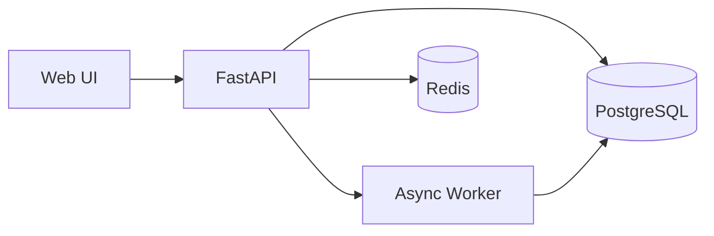

> 경로 해석: 이 문서의 경로는 `.claude/docs-file.json`의 `docs_root` + `sections` 값으로 해석한다.

# 시스템 설계서 템플릿

## 1. 전체 시스템 아키텍처

### 1.1 아키텍처 개요 (Mermaid Summary)

### 1.2 상세 다이어그램
- Excalidraw 파일: `{3_system_design}/<architecture-file>.md`
- 범위: Context, Container, Flow, NFR Notes

## 2. 컴포넌트 설계

| 컴포넌트 | 책임 | 입력 | 출력 | 실패 시 동작 |
|---|---|---|---|---|
| Web | 사용자 인터랙션 | API 응답 | 화면 상태 | 에러 UI 표시 |
| API | 유스케이스 처리 | HTTP 요청 | JSON 응답 | 에러 코드/로그 |
| Worker | 비동기 작업 처리 | 큐 메시지 | 처리 결과 | 재시도/데드레터 |
| DB | 영속 저장 | SQL | 레코드 | 트랜잭션 롤백 |
| Redis | 캐시/큐 | 키/메시지 | 값/이벤트 | 만료/재적재 |

## 3. 데이터 흐름과 상태 전이

### 3.1 정상 흐름
1. 사용자 요청 수신
2. API 검증/처리
3. DB 조회/저장 및 캐시 반영
4. 응답 반환

### 3.2 오류 흐름
1. 외부 연동 실패 -> 재시도/대체 응답
2. DB 오류 -> 롤백/오류 코드 반환
3. 큐 지연 -> 백오프 및 알림

## 4. 비기능 요구 대응

| NFR 항목 | 대응 설계 | 검증 방법 |
|---|---|---|
| 성능 | 캐시, 인덱스, 비동기 처리 | p95 응답시간 측정 |
| 보안 | 인증/인가, 입력 검증, 시크릿 분리 | 취약점 점검 체크리스트 |
| 가용성 | 헬스체크, 재시도, 장애 격리 | 장애 시나리오 리허설 |
| 관측성 | 구조화 로그, 메트릭, 트레이싱 | 대시보드/알람 확인 |

## 5. 배포 및 운영 전략

- 환경: local / staging / production
- 배포: CI/CD, 마이그레이션 순서, 롤백 절차
- 모니터링: API 오류율, 지연, 큐 적체, DB 상태

## 6. 추적성 매핑

### 6.1 FR/NFR -> 설계 요소
| 요구사항 ID | 설계 컴포넌트 | 근거 섹션 |
|---|---|---|
| FR-xxx | API, Worker | 2, 3 |
| NFR-xxx | Cache, Monitoring | 4, 5 |

### 6.2 UI -> API -> 데이터
| UI 화면 | API 엔드포인트 | 데이터 저장소 |
|---|---|---|
| 화면 A | GET /api/... | PostgreSQL |
| 화면 B | POST /api/... | PostgreSQL, Redis |

## 7. 가정 및 오픈 이슈

| 구분 | 내용 | 상태 | 다음 액션 |
|---|---|---|---|
| 가정 | 예: 동시 사용자 200명 | 확인 필요 | 부하 테스트 |
| 이슈 | 예: 외부 API rate limit 미확정 | 진행중 | 공급자 문서 확인 |
