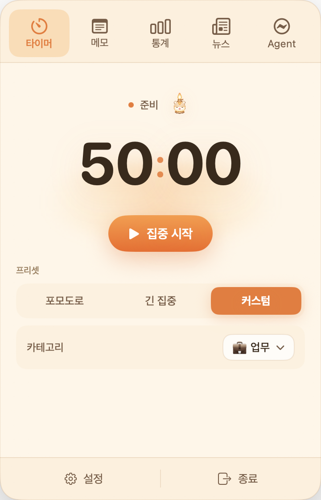
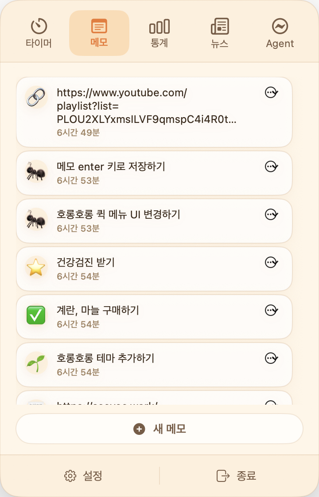
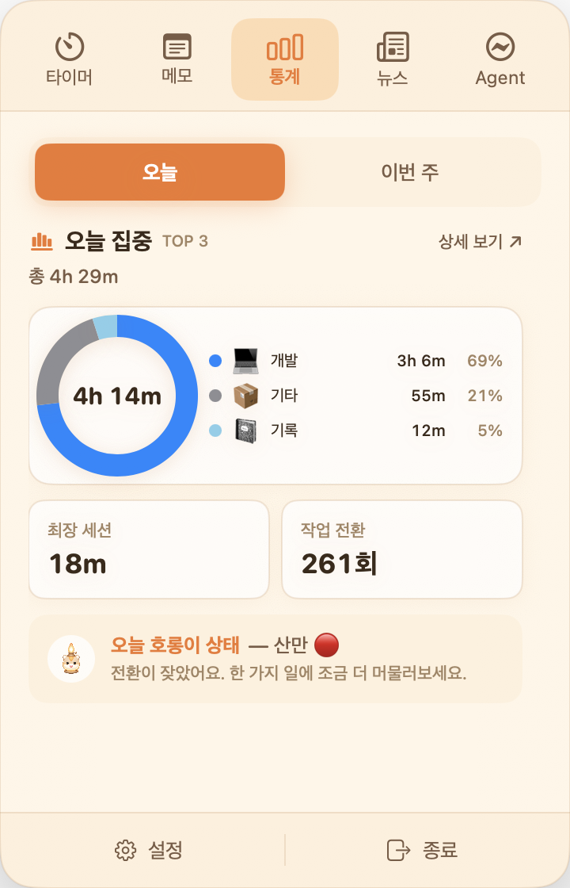
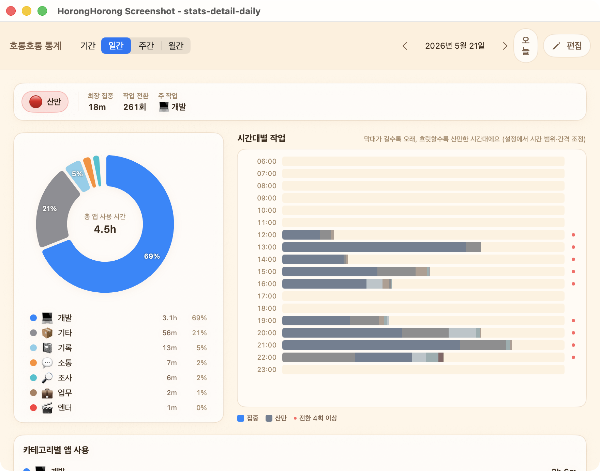
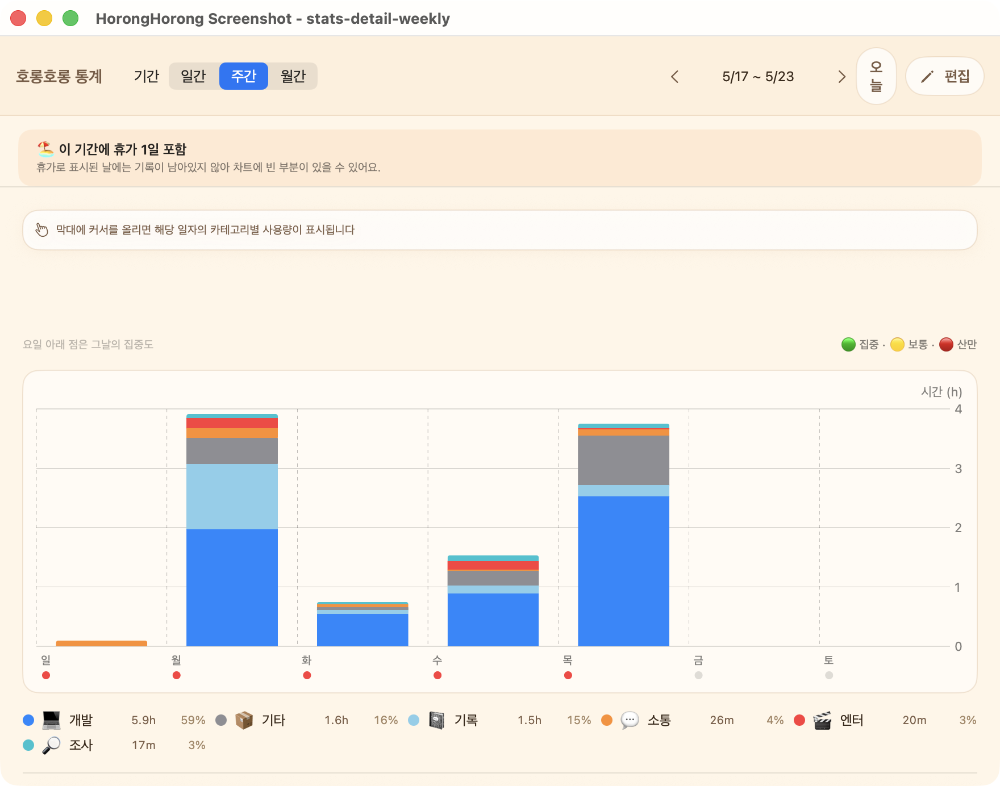
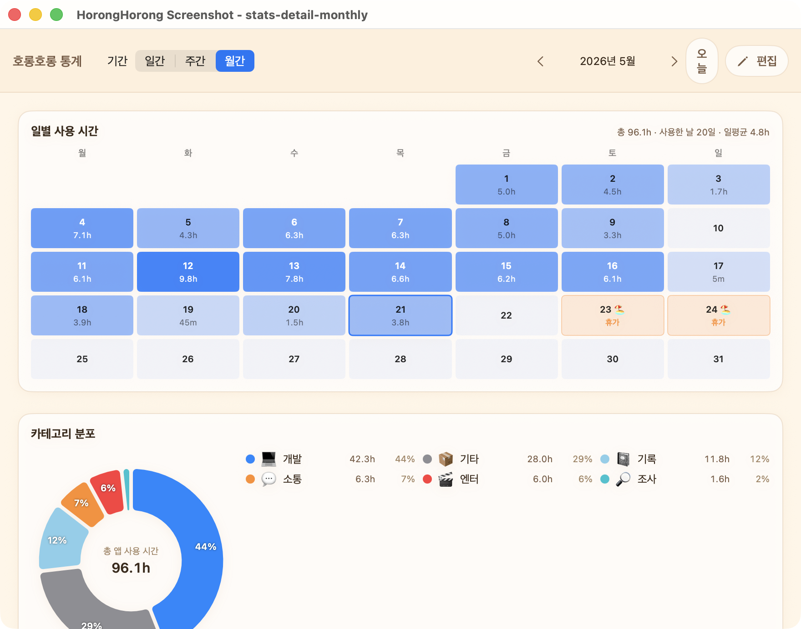
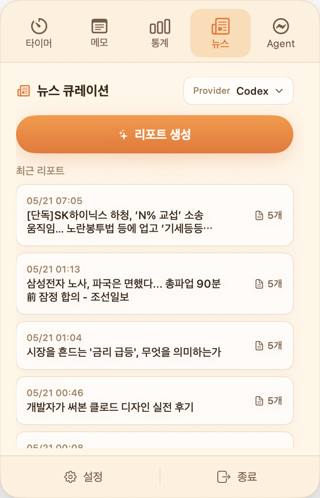
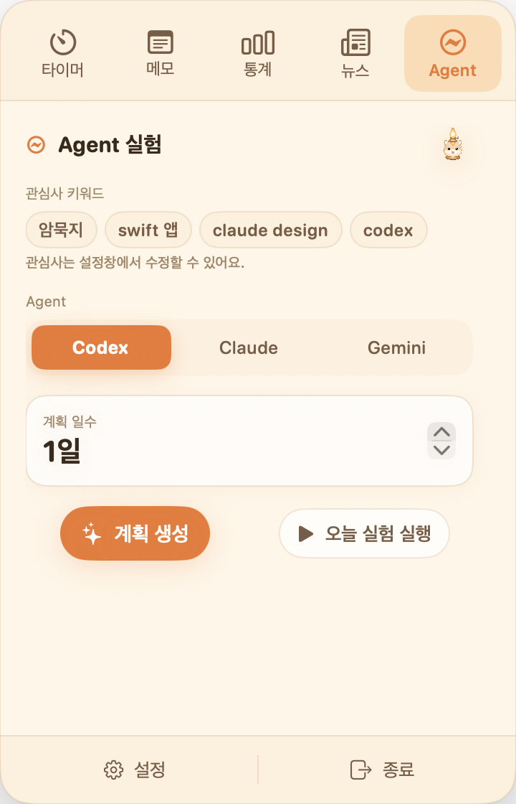
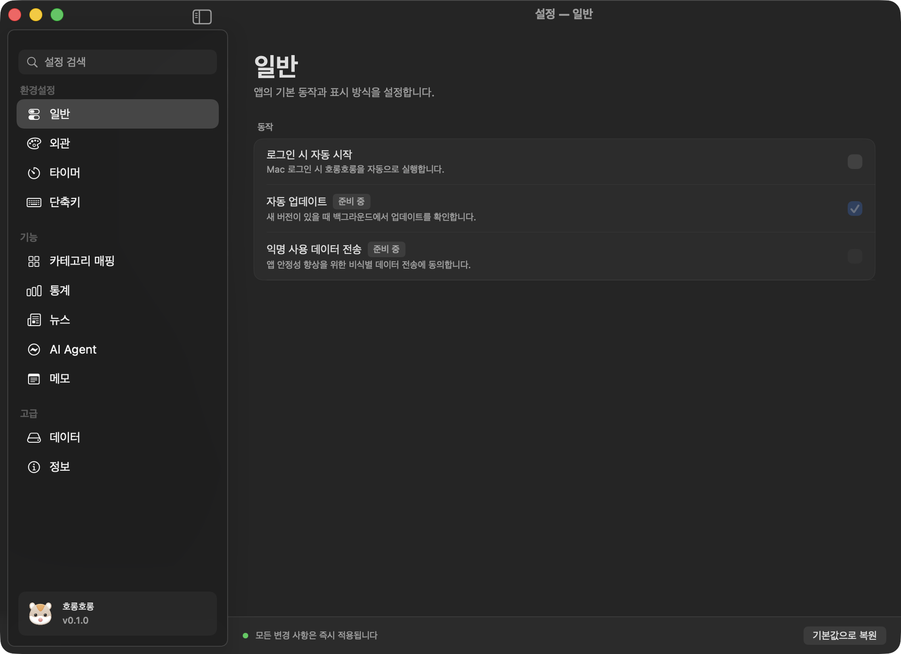

<div align="center">

# HorongHorong

**Horong** — *the little vessel that holds the flame in your menu bar.*

A horong is a small vessel that protects a quiet flame from going out. <br>
That flame represents hope, aspiration, $\color{#D97706}{\textbf{focus}}$, and personal goals. <br>
Like a horong gathers and shelters its light, this app helps hold scattered $\color{#D97706}{\textbf{focus}}$, collect $\color{#D97706}{\textbf{interests}}$ in one place, and create an $\color{#D97706}{\textbf{environment}}$ where small experiments can begin.

<!-- TODO: Replace the representative image / hero banner. Currently using yagyong_jeong4.png as a temporary image. -->


<br />

[](#requirements)
[](https://swift.org)
[](LICENSE)
[](assets/LICENSE)
[](https://github.com/Jungjihyuk/HorongHorong/releases)
[](https://github.com/Jungjihyuk/HorongHorong)

<sub><a href="README.md">한국어</a></sub> · <sub>English</sub>

</div>

---

<div align="center">

> *With one small lamp — illuminate focus, gather interests, and light up small experiments.*

<br />

<a href="https://github.com/Jungjihyuk/HorongHorong/releases/latest"><strong>📥 Download Latest Release</strong></a>
 · 
<a href="#b-build-from-source"><strong>Build from Source</strong></a>

<sub>Official releases are still being prepared. For now, you can try the app by building it from source.</sub>

</div>

<br>

**HorongHorong** is a multi-purpose productivity app that lives in the macOS menu bar. <br>
It brings together a `Pomodoro timer`, `app usage tracking`, `quick memos`, `news curation`, and `AI Agent experiments` under one menu bar icon.

### Why This Exists

- **To reconnect scattered $\color{#D97706}{\textbf{focus}}$** — Jumping between a timer, usage tracker, memo app, and news reader can keep breaking the shape of your work. HorongHorong keeps those tools in one lightweight menu bar surface, so you can return to focus without leaving your flow.
- **To gather $\color{#D97706}{\textbf{interests}}$ quickly** — Videos, articles, and trends become heavier as they pile up. HorongHorong collects sources, lets an LLM classify and summarize them, and keeps your interests gathered in one place.
- **To create an $\color{#D97706}{\textbf{environment}}$ for small experiments** — Seeing good information is easy; turning it into something you build is harder. HorongHorong connects AI Agent CLI tools from planning to execution, shortening the path from consumption to creation. Data is stored locally with SwiftData, and AI calls run through CLI tools installed by the user.

## 📌 Features

<table>
<tr>
<td width="45%" valign="middle">

### 🕐 Pomodoro Timer
Manage focus and break cycles with presets: 50/5, 100/10, and custom. The menu bar icon changes to 🔥/☕ and shows the remaining time. When a session ends, HorongHorong shows both a system notification and a floating toast.

</td>
<td width="55%" align="center">

</td>
</tr>

<tr>
<td width="45%" valign="middle">

### 📝 Quick Memo
Open a floating input panel from anywhere with a global shortcut. Saved memos are stored permanently and can be reviewed in the menu bar memo tab, sorted by newest first.

</td>
<td width="55%" align="center">

</td>
</tr>

<tr>
<td width="45%" valign="middle">

### 📊 App Usage Statistics
Track the active app in the background and automatically aggregate time by category: Work / Development / Study / Research / Log / Communication / Entertainment / Other. Check today's usage quickly from the menu bar summary, or open the detail view for daily, weekly, and monthly statistics.

</td>
<td width="55%" align="center">
<table>
<tr>
<td align="center" width="50%">

<sub>Summary</sub>
<br />
</td>
<td align="center" width="50%">

<br />
<sub>Daily</sub>
</td>
</tr>
<tr>
<td align="center" width="50%">

<br />
<sub>Weekly</sub>
</td>
<td align="center" width="50%">

<br />
<sub>Monthly</sub>
</td>
</tr>
</table>
</td>
</tr>

<tr>
<td width="45%" valign="middle">

### 📰 News Curation
Collect data from channels you frequently use, such as YouTube playlists, Google News, and yozmIT. An LLM classifies the content by category and generates one-line summaries. Results are saved as daily Markdown reports.

</td>
<td width="55%" align="center">

</td>
</tr>

<tr>
<td width="45%" valign="middle">

### ⚡ AI Agent Experiments
Call Claude / Codex / Gemini CLI to generate an N-day experiment plan, then select and run the section for the current day.

</td>
<td width="55%" align="center">

</td>
</tr>

<tr>
<td width="45%" valign="middle">

### ⚙️ Settings / Category Mapping
Customize app-to-category mapping rules, add/delete/rename categories, choose an LLM provider, set interest keywords, and configure data paths from the settings tab.

</td>
<td width="55%" align="center">

</td>
</tr>
</table>

---

## 🚀 Installation

There are two ways to use HorongHorong — choose **A. Download and Run** if you want the quickest path, or **B. Build from Source** if you want to build the app yourself or contribute.

### A. Download and Run

Official releases are still being prepared. Once a release is available, you will be able to download a `.dmg` or `.zip` file from the link below.

[**📥 Download Latest Release →**](https://github.com/Jungjihyuk/HorongHorong/releases/latest)

> ⚠️ **First launch notice** — HorongHorong is not yet signed with an Apple Developer certificate or notarized. On first launch, macOS may show an "unidentified developer" or "damaged app" warning. In that case:
> 1. Go to **System Settings → Privacy & Security** and click "Open Anyway".
> 2. Or run this once in Terminal:
>    ```bash
>    xattr -dr com.apple.quarantine /Applications/호롱호롱.app
>    ```

<!-- TODO: Enable this section after the first .dmg release. -->
<!-- TODO: Add a Homebrew Cask command after the tap is registered.
```bash
brew install --cask USER/horong/horonghorong
```
-->

### B. Build from Source

Use this path when you want to build the app directly or contribute to the codebase.

#### Requirements
- macOS 14.0 or later
- Xcode 16.0 or later
- Swift 6.0
- UI language: Korean
- Data storage: SwiftData (local)
- [`xcodegen`](https://github.com/yonaskolb/XcodeGen) — `brew install xcodegen`
- [`uv`](https://github.com/astral-sh/uv) — *(required for the news feature)* `brew install uv`
- At least one LLM CLI — *(required for news / Agent features)*
  - `claude`, `codex`, `gemini`, `opencode`

#### Build Steps

```bash
git clone https://github.com/Jungjihyuk/HorongHorong.git
cd HorongHorong
xcodegen generate
xcodebuild -scheme HorongHorong -configuration Debug build
open ~/Library/Developer/Xcode/DerivedData/HorongHorong-*/Build/Products/Debug/호롱호롱.app
```

#### News Pipeline Environment (Optional)

```bash
cd Agents/news_report
uv sync
```

---

## 🪔 Usage

Detailed behavior and options for each feature are documented separately.

| Document | Description |
|------|------|
| [`USER_GUIDE.md`](USER_GUIDE.md) | Basic guide for each menu bar tab |

<!-- TODO: Add one or two GIFs for core actions, such as starting the timer or opening quick memo. -->

---

## 🤝 Contributing

Contributions are welcome.

1. **Open an issue first** — bugs, features, documentation, and questions are all welcome.
2. Once the discussion is clear, fork the repository, create a branch (`feature/#issue-number-short-description`), and open a PR against `dev`.
3. Follow the recommended PR body format in [`CONTRIBUTING.md`](CONTRIBUTING.md).
4. You can use the repository's `.claude` skills to generate commits, issues, and PRs that follow the project conventions.

> For the full contribution guide — including project direction, the fast-merge PR checklist, development setup, and commit/PR conventions — see [`CONTRIBUTING.en.md`](CONTRIBUTING.en.md) ([한국어](CONTRIBUTING.md)).

### Code of Conduct

Please review the Code of Conduct before participating in the project.

- [English Code of Conduct](CODE_OF_CONDUCT.en.md)
- [한국어 행동 강령](CODE_OF_CONDUCT.md)

---

## 📄 License

HorongHorong applies separate licenses to **source code** and **image/character assets**.

| Area | License | Summary |
|------|----------|------|
| Source code | [Apache License 2.0](LICENSE) | Free to use, modify, and redistribute, including patent grant |
| Image/character assets (`assets/`) | [© All Rights Reserved](assets/LICENSE) | May only be used to identify or refer to the HorongHorong project |
| "HorongHorong" name and logo | Unregistered trademark of Jihyeok Jung | See the [trademark policy](assets/LICENSE) |

### Quick Summary

- ✅ **Source code** — Free to use, modify, redistribute, and use commercially under Apache 2.0. You must preserve license, copyright, and NOTICE information.
- ✅ **Assets** — You may use them to introduce, review, report on, or cite HorongHorong, and you may share screenshots from your own environment.
- ❌ **Assets** — Do not impersonate the project character/mascot, reuse it as an identifier for unrelated products, modify it and present it as your own work, or make commercial goods with it.
- 📩 For other uses, contact [wlgur278@gmail.com](mailto:wlgur278@gmail.com).

### Third-Party Components

This project depends on [HotKey](https://github.com/soffes/HotKey) (MIT License, © Sam Soffes). See [`NOTICE`](NOTICE) for details.

---

## ✨ Contributors

<div align="center">
<a href="https://github.com/Jungjihyuk">
<br />
<sub><b>Jihyeok Jung</b></sub></a><br />
<a href="https://github.com" title="Code">🛠️</a>


🪔 *Made with a small flame.*

</div>
